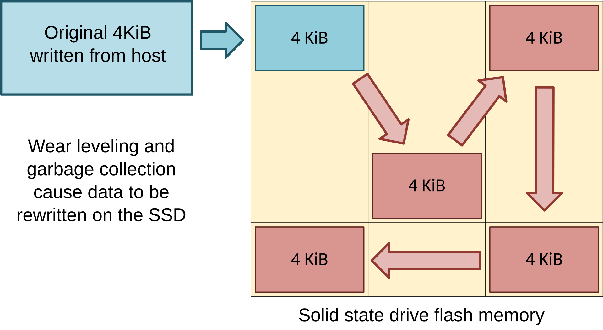
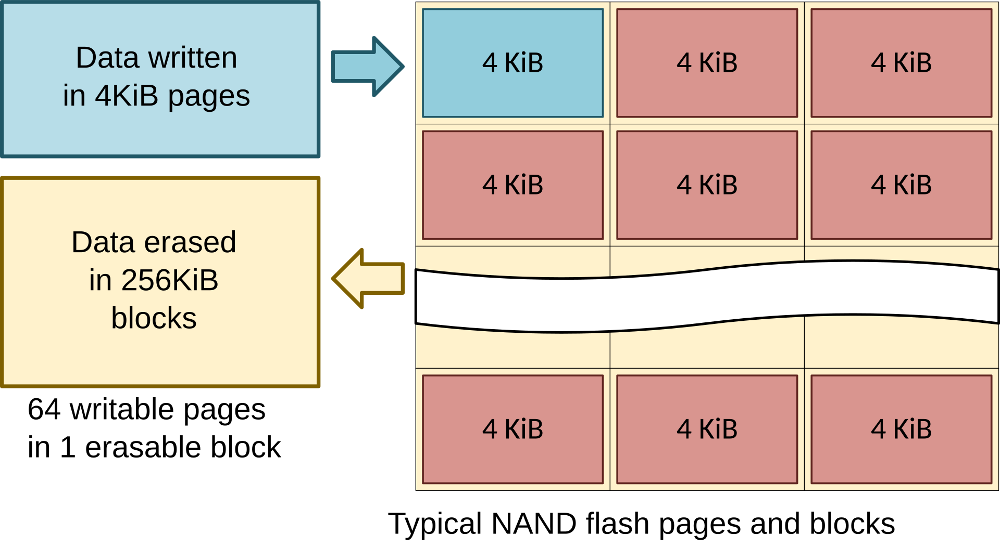
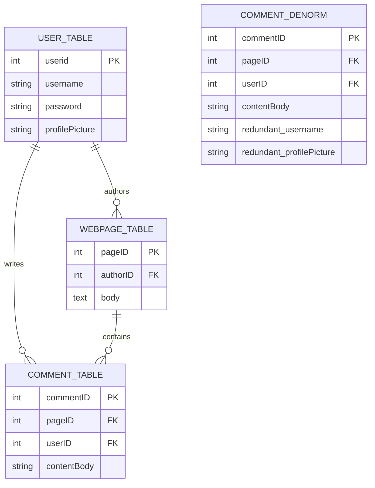
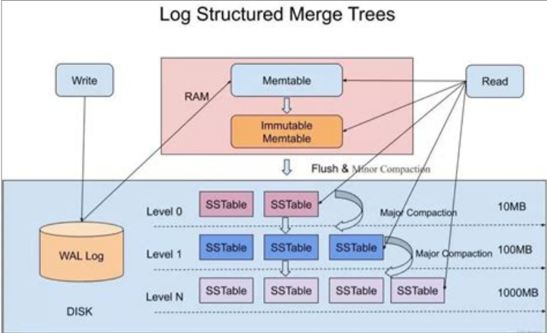

# Considerations for the Storage System

## Introduction

What does storage system optimization mean from the perspective of a performance engineer? 

We will cover the following topics in this resource:

1. Application Specific Trade-offs
1. Examining Interactions With Storage
1. Using Storage to Improve Performance
1. LSM Trees
1. Storage System Fault Tolerance
1. Case Studies

## Application Specific Trade-offs 

A key aspect of performance engineering is understanding the trade-offs that go into each engineering decision made about a system. Understanding the requirements of the application is essential to effective optimization. Interacting with the storage system is no exception.

- Runtime Performance vs Space Utilization
- Runtime Performance vs Data Integrity
- Runtime Performance vs Observability (Logging)
- Space Utilization vs Storage Reliability
- Space Utilization vs Time To Market

As we explore how to better interact with the storage system when we look at optimizing our code, these trade-offs will continue to come up in be explored in detail.

### Space Utilization

#### Using Space Efficiently

There are sometimes cases where the needs of an application will require a programmer to regard efficient utlization of the storage system as a parameter of particular importance. This is true whenever storage space is limited such as porting videogames for consoles, but a more extreme example is in embedded systems. Due to low level design decisions, a programmer for embedded systems may find themselves writing code to run on devices where storage space can be on the order of kilobytes. If significant amounts of data are to be written to devices of such limited size, care must be taken to ensure that the needs of the application can be made to fit within the confines of the hardware.

#### Using Space Inefficiently

In many cases however, storage space is not the most important parameter to be optimized for, and there are in fact many cases where the parameters more important to an application rely on techniques that intentianally use storage space inefficiently.

These will be expanded upon in the Using Storage to Improve Performance section.

## Examining Interactions with the Storage System

- `fsync`
- Fragmentation
- Thrashing
- Read/write amplification
- Improper access patterns
- Impact of Logging

### `fsync` and Buffering

`fsync` is a syscall that ensures that the file descriptor being operated on has completed its write to the disk. Upon completion, the program can be confident that the data will be recoverable in the event of a crash or power failure.*It is expensive.* However, it is the only way for an operating system to be sure that the requested data has made it to the storage device.

Significant speed improvements can be achieved by buffering writes to minimize the number of `fsync` calls in a program. However the biggest trade-off to consider in this case is that of data integrity. If using heavy write buffering, the larger the buffer size prior to an `fsync`, the more data can be lost in the event of a crash. The Runtime Performance vs Data Integrity trade-off requires us to be conscious of when we can afford to lose a little data here and there, and when we can't. A text editor can afford to miss a few recent uncommitted lines. We expect a videogame to likely not be able to recover all of the most up to date data following a device power failure. These are applications where the user experience is much more important than absolute data integrity. In contrast, computer systems responsible for critical infrastructure, banking, government records, systems compliant with FDA Title 21 CFR Part 11 are application areas where data integrity is held at a much higher regard than user experience. Design decisions must be made with those considerations in mind.

The OS will buffer writes on its own to minimize the necessity for `fsync` calls. This means that if an application values data integrity over performance, `fsync` will need to be manually called to guarantee writes make it to disk. However in specific circumstances, a programmer may choose to manually buffer in user space. A reason to do this might be to strike a middle ground in the Performance vs Data Integrity spectrum. If no buffer causes very slow performance and a large buffer causes very fast performance but at high risk, an application may opt for a middle ground and choose to create a manual buffer somewhere in between, at a happy medium applicable to the application's needs. Another consideration when creating a manual buffer is the potential performance cost of a chosen buffer size that would negatively affect cache / paging performance. Choosing a buffer size based on page size is a good idea, to ensure that the buffer does not cause poor memory performance while trying to improve storage performance.

### Fragmentation

Fragmentation refers to when chunks of data are stored in discontiguous locations on a HDD. This is a problem, since the spinning disk and read/write head take a long time to get to where they need to be to perform read/write operations. Scanning between discontiguous locations incurs this physicality penalty more times than would be required by the system if the data were stored contiguously. In a HDD, occasional defragmentation is recommended to make sure that gaps in the disk are closed, so that data accesses can be performed more efficiently.

While this is of particular note for HDDs due to how the underlying technology used, flash-based storage like SSDs do not have this problem. By not having mechanical moving parts, the hardware technology improves the performance of random accesses relative to that of a hard disk. The result of this is that fragmentation is not a significant problem for SSDs performance. Flash technology imposes an opposing restriction however, which is the number of write cycles for a given block of data, usually around 10,000 to 100,000 cycles. Beyond the rated number of write cycles for a block of flash data, the ability for the drive to store new data becomes degraded, limiting the effective life of the device. Additionally, SSD hardware controllers actually intentionally fragment their data in a process called wear levelling, where they may store data in physically discontiguous blocks in order to improve the lifespan of the drive by ensuring that no block gets a disproportional amount of write cycles. Think of this like tire rotations in maintenance of a car. For these reasons, it is recommended that SSDs not be defragmented, due to the fact that rewriting large chunks of data at a time reduces device lifespan without providing significant performance improvements.

### Thrashing
Thrashing refers to the process where the computer's memory(RAM) becomes full and begins to overflow, causing a constant state of paging. Paging is a process in most OS's that swaps data between the memory and disk using a dedicated file (such as pagefile on Windows or th eswap partition in Linux) for managing memory. 

Since disk access is much slower than memory access, constantly paging forces the processes relying on the data to wait for the I/O operation, causing the CPU to idle in many cases. If this behavior continues, the constant swapping between disk and memory causes a signifcant increase in memory and disk traffic, slowing and in some cases even preventing other I/O operations. Even with very high speed NVMe SSDs, with their high access speed and incredibly parallel queueing, this can cause a collapse in performance. In some cases, the OS may see that the CPU is being underutilized and attempt to schedule more tasks, amplifying memory usage. Additionally, the incredibly high disk traffic can significantly reduce the lifetime of SSDs due to the constant writing and reading from the pagefile. To avoid thrashing behaviour, it is important to be very careful in managing memory usgae for processes. Unintentionally poor memory behaviour not only impacts the performance of the memory system, but can also cause poor performance at the disk level for all running processes.

### Read/Write Amplification

Read/Write Amplification refers to operational overhead resulting from the low level hardware implementation of SSDs that result in larger amounts of data being read or written whenever a storage system access occurs. This can cost performance and reduce the lifespan of SSDs.

Solid state drives store their data in pages (often 4KiB) within blocks (usually 256KiB). Writing happens at a granularity equal to the page size, and erasing happens at a granularity equal to block size, and all writes must be performed on an already free page. This means if a new 4KiB is being written to the SSD, the SSD controller will look for a free page where the new data can be stored, and will track its location for later accessing. This process alone already creates write amplification up to the page size if the data being written is smaller than a full page. Making new writes to an SSD align to the page size mitigates write amplification.

However, if a previously written page is being modified, since pages cannot be edited and must be rewritten to a new free page and since the granularity for erase operations is so much larger than the page size, there are many pages within the erase block that will eventually need to move to a different block in order to be preserved after the block erasure. The new modified page will need to be written to a different location on the SSD, and then finally the block that held the stale original page must be erased, which is handled eventually by garbage collection. This means that an overwrite operation not only amplifies a <4KiB write up to a 4KiB write to align with the page size, but a modification of a page results in potential worst case of up to 255KiB additional page rewrites into different locations on the drive due to the 256KiB block erasure requirement for rewrites, also handled eventually by the SSD controller. All of this means that small writes to an SSD can have cascading effects through interactions with the the garbage collection and wear levelling that result in signifcantly larger amounts of memory interactions occurring. Sequential, page-aligned writes minimize write amplification, while small random overwrites tend to maximize it.


A user writes up to the page size at a time during an SSD write. Anything smaller gets amplified up to the page size, in this case 4KiB. Then, due to wear leveling and garbage collection, this page can get bounced around and rewritten to different locations throughout the life of the device, cascading writes, reducing the drive's lifespan, and potentially impacting drive latency if these rewrites occur coincinding with future accesses.
Image source: [Wikipedia](https://en.wikipedia.org/wiki/Write_amplification)


4KiB write pages and 256KiB erase blocks. In order to modifiy data in a page, the SSD writes the new modified page to a new, free page elsewhere. The old page is marked stale. The whole block will eventually be erased by garbage collection.
Image source: [Wikipedia](https://en.wikipedia.org/wiki/Write_amplification)


### Access Patterns

Similar to memory access, storage system access also rewards access to sequential blocks of data storage. The hardware implementations of hard disk based storage means that accessing data on disk can have a high latency while waiting for the read/write head to move to the location on the spinning disk between each access. This means that a program can be greatly rewarded by reading and writing data in contiguous sequential blocks as opposed to random accesses when interacting with HDD devices. This affect still carries over to access on an SSD due to affects like read/write amplification and `lseek` overhead, as we will explore in this section.

The key takeaway here is that random accessing is less efficient in terms of per byte access performance than sequential bulk accesses to a the storage system. Structuring file system storage with keeping sequential accessing in mind can help speed up performance. Understanding the access patterns that are needed by the application allow the programmer to weigh the pros and cons of using several random accesses against using a few larger sequential accesses. The amount by which sequential access can speed up performance may sometimes justify reading or writing more data than is actually needed by the program. It is important to note that the general advice about keeping accesses sequential and aligned to storage blocks is very similar to advice about using main memory RAM due to cache behavior. The same advices comes out in regards to the storage system, but for different reasons.

#### `lseek`

`lseek` is a syscall that allows for seeking to a specific byte offset in a given file descriptor. This is how random access in a file is performed. Being a system call, this brings some overhead with it each time it is needed. Sequential reads from a file are able to eliminate `lseek` overhead if a file needs to be read multiple times by a program. 

See the referenced code in the Impact of Random Access Pattern Code Example at the end of this document.

The code example demonstrates costs of random accessing lines in a file using `lseek`. It does so by reading a file with 100000 lines forwards fully sequentially, and by reading the same file backwards, using `lseek` at every line, seeking backwards each time. On my machine, the sequential read pattern without any seeking completes in 53ms, while the random access read pattern using `lseek` at every line completes in 99ms. This is a roughly 2x speedup for reading the same amount of data. In practice, this means that sometimes it may be more performant to read a large chunk of sequential data, potentially reading more data than is actually needed by the program in order to keep the data accesses sequential.

<!-- ### TODO: Write-ahead logging -->

### Impact of Logging

A significant aspect of maintaining software systems is to be able to have visibility into the operation of the production code. This allows the maintainers to be able to see into the system as it runs, or in many cases after it crashes. As with any good tool, its use is not free. This is the Runtime Performance vs Observability tradeoff. By requiring additional actions from your system, there will be a cost to performing these actions. In many cases, due to ease of use and interacting with a program, the developer may want to print logs directly to stdout or stderr. However as we will see in the following code example, this can incur its own overhead compared to further usage of the storage system. The code example demonstrates what we can expect to pay in performance for different types of file writing paradigms to gain some insight into the cost of specific file system interactions. 

See the referenced code in the Impact of Logging and Buffering Code Example at the end of this document.

Running this benchmark, the expected behavior is that the `silent` will be the fastest process due to no additional overhead being taken on, trading off all observability for performance. Next fastest is `buffered_ofstream`, which buffers writes in user space. This takes syscall overhead away, and results in performance surprisingly close to the `silent`, due to the fact that ofstream is already implemented to optimize for performance. The next test is `buffered_os`, which drops the user abstraction layer of ofstream, leaving behind write syscalls that get buffered by the OS. Due to still using write buffering, this implementation is still significantly faster than the `fsync` version due to minimizing the total number of times that the system reaches out to the storage media itself. Finally, the `fsync` test demonstrates just how costly the `fsync` operation actually is. 

Comparison of these last two tests demonstrate not only the Performance vs Observability tradeoff, but also the Performance vs Data Integrity. These are the exact same function, except one manually fsyncs between each write and the other does not. The result is that the really slow one actually gets the benefit of having more stable crash performance, since in between each iteration, the OS gets the guarantee from the storage medium that the data that the user has attemtped to write has actually make it to the hardware. Conversely, the significantly faster buffered versions all have inferior crash stability because even after the benchmark thinks that the write operation was performed, the data never makes it to the storage medium until the final `fsync` occurs at the end. That means data could still be lost between writing to the buffer and writing to disk, resulting in data integrity bugs in the program.

## Using Storage to Improve Performance

Parity bits and error correction codes are used by storage systems at the hardware level to identify or even correct for data storage issues over time. This does not however allow for protection against filesystem corruption. Checksums should be used to detect corruption above the device layer.

Memoization is the practice of storing the results to expensive calls to functions. This is often done in main memory and may not always reach the storage system, but in the context of larger data systems, this could spill over. 

In databases, this manifests as denormalization. Duplicate copies of data can be included near other pieces of data which will need to often be accessed together. This optimization increases storage utilization, harms write performance of the database due to data being stored in multiple places, but can significantly improve read performance for the most common cases.


The above ERD demonstrates how denormalizing data can be beneficial, especially in database-style environments. In the normalized version (left), when a page is loaded, the system must load the page body, perform a read operation to find each comment that the webpage contains, and then, for each comment, read the User table to find the username and profilePicture values. This ends up being a lot of reads.

By denormalizing the data and storing the redundant username and profilePicture data with the comment data, there is no longer a need to read the User table for each comment. Going a step further, it could even be possible to have a separate file for each pageID, so only one sequential read of that file would be needed when loading the page. This denormalization drastically reduces the number of reads, with the cost being the need to write additional data—potentially doubling write costs in the worst case. However, since this application is read-heavy and likely not very write-heavy, this tradeoff is very beneficial. It is important to consider the common use case, since an application that is updated frequently but only read infrequently would not benefit from this tradeoff.

## Log-Structured Merge Trees

A Log-Structured Merge (LSM) Tree is a data structure used to optimize performance for working with large amounts of data on disk, specifically for database systems. By carefully controlling the structure, size, and write behavior of data, LSM trees create highly optimized write behaviour without sacrificing read performance in the common cases. 

When writing to disk with an LSM, all write data is first accumulated in memory in a MemTable. When the MemTable is full, the entire contents are sorted and flushed to the disk as an "L0" file. This guarantees that the write is fully sequential and is significnatly faster than finding existing records and modifying them in place

When the L0 layer fills up, a process called compaction occurs. 
 - A set of L0 files are selected. All of the keys in those files are identified, and the files are then merged into L1 files
 - Each L1 file, and every file in a layer above it, has a unique, non-overlapping key range with other files in the same layer. For example, L1 File 1 may have keys in range 1-10 while L1 File 2 contains keys in range 11-20.
 - During the merge, obsolete or deleted data is cleaned to preserve data integrity.

As layers fill up, this compaction continues up to the final layer. The size of each layer scales by a constant factor, such as each layer being 10x bigger than the previous one. The compaction step is the only real write-overhead incurred by this structure, but since compaction occurs infrequently, it can often be scheduled in a way that doesn't interfere with running processes.

While the benefits for write behaviour are obvious, the structure is also fairly good for read behaviour. The tree is structured by recency, so recently update data is found on the lowest levels, like L0. In the worst case, which is reading data that hasn't been update din a very long time, the system must read every L0 file and one file on each level above it. The non-overlapping key structure means the system knows which file in each layer the data could be in, meaning there are no unnecessary reads.

Compared to the common B+ trees, the LSM tree has much better write performance. Additionally, while the B+ tree has a smaller search space, it often causes random I/O for reads, meaning the actual read performance is comparable to that of the LSM. Where B+ trees outperform LSMs is mostly in reading entire ranges of data, since this requires scanning the contents of every L0 file and every releveant file at higher levels as well until the full range is found, while B+ trees can simply move linearly once the starting index is found.


## Storage System Fault Tolerance

Storage hardware already does some things on its own that you don't need to worry about, but it helps to be aware of what they can and what they can't do for you.

### What the hardware does do

Storage drive hardware is designed to protect the integrity of bits stored in the device, protect the device's lifespan, and degrade gracefully over time instead of crashing.

Storage is not perfect so errors are expected to occur after a certain amount of time, especially as drives age and wear over time. Error correction codes (ECC) are a mechanism that drive controllers use for identifying and correcting for bit corruption that occurs in the device over time. This protects against internal storage issues, slowly degrading memory cells, or other causes for bits to get errorneously flipped.

Device controllers are also responsible for identifying failing sectors and will remap storage away from these blocks in order to hide the negative effects of these failures. This means that over time the effective storage space of a drive will shrink as more and more of the drive ages and degrades. SSDs specifically also use wear leveling to distribute the load on specific storage blocks, and will internally garbage collect to keep pages free for further writes when possible.

### What the hardware does not do

While storage device hardware does a lot of work to ensure that it operates as the programmer expects, device controllers cannot work miracles. There are some remaining considerations at the application level needed to ensure reliability of the storage system. The drives themselves cannot protect against filesystem corruption, bad file writes, accidental data deletion, or application bugs. These must all be handled at the user level.

Data corruption above the device layer can be detected via the use of [checksums](https://en.wikipedia.org/wiki/Checksum).

Storage drives controllers can help ensure integrity of storage as long as they are working as intended, but drives can and do fail over time. The only real way to ensure data persists in the event of a drive failure is to have the data stored in more than one place. If data persistance is important to the application, special care must be taken beyond the device level, in the form of redundancy across multiple domains.

#### Redundancy Across Disks

A local machine may choose to use multiple storage drives in order to avoid losing data due to drive failure. [RAID (Redundant Array of Independant Disks)](https://en.wikipedia.org/wiki/RAID) is a method whereby multiple disks are configured in a way that allows data to persist in the event of storage hardware failure.

RAID 1 is a system that uses two parallel drives, with the data from one drive mirrored on the other. This is a very simple backup paradigm that provides the utility that if one drive fails, the other will persist with the original data intact. It does not use space efficiently, since it uses two whole drives to store one drive's worth of data.

RAID 2-4 are a series of intermediate steps of increasing complexity. They do not have practical uses in the real world at these levels, but exist pedagogically to help understand the complexity of the more practical RAID 5.

RAID 5 is a more space efficient storage configuration that uses block-level striping and distributed parity to allow for reconstruction of lost data through the use of the parity bits distributed over the other storage drives in the event of singular device failure. The specific implementation is outside the scope of this resource since it is not a performance optimization topic, but it is nonetheless interesting and worth [reading more about](https://en.wikipedia.org/wiki/Standard_RAID_levels#RAID_5).

#### Redundancy Across Machines

Storing data in multiple geographic locations can be prudent in specific applications where data persistence is top priority, as it helps to ensure the durability of data against hard to predict contingencies that would otherwise affect specific storage devices like a fire in a data center or other physical disaster that could compromise data storage. A practical solution for developers could be to use a cloud service provider to store a redundant backup of their data, in addition to locally storing it. That way if either system becomes compromised, the replica remains available.

#### Redundancy Across Time

Maintaining backups or snapshots of system configuration can help ensure that data is not lost across time. Systems like git can help to manage versioning for a codebase, or computer system snapshot utilities exist for many modern operating systems. These help ensure that if some new change invalidates the most recent copy of the data, that an older copy exists that will still remain intact.

## Case Studies

### Impact of Random Access Pattern Example

See `lseek` for relevant analysis.

```python
# Use this script to generate the input file for the C++ random access benchmark demonstration
with open("input_file.txt", 'w') as file:
  for i in range(100000):
    file.write(f"line {i:5}\n")
```

```C++
#include <iostream>
#include <fstream>
#include <chrono>
#include <cstdio>
#include <cstring>
#include <fcntl.h>
#include <unistd.h>
#include <vector>

using namespace std;
using namespace std::chrono;

const char* FILENAME = "input_file.txt";
const int N = 100000; // Number of lines to read
const int line_len = 11;  // length of each line (bytes)

void test_lseek() {
    // Open file read-only
    int fd = open(FILENAME, O_RDONLY, 0644);
    char buf[line_len];
    vector<string> vec;
    vec.resize(N);
    int byte_counter = 0;

    auto start = high_resolution_clock::now();
    
    // Read the file backwards using lseek between each read to simulate random access
    lseek(fd, -1 * line_len, SEEK_END);
    for (int i=0; i < N; i++) {
        auto bytes_read = read(fd, buf, line_len);
        vec.emplace_back(buf);
        lseek(fd, -2 * line_len, SEEK_CUR);
    }
    close(fd);
    auto end = high_resolution_clock::now();
    
    cout << "test_lseek completed in " 
         << duration_cast<milliseconds>(end - start).count()
         << "ms\n";
}

void test_sequential() {
    // Open file read-only
    int fd = open(FILENAME, O_RDONLY, 0644);
    char buf[line_len];
    vector<string> vec;
    vec.resize(N);

    auto start = high_resolution_clock::now();
    // Read the whole file by performing reads sequentially, with no seeking.
    for (int i=0; i < N; i++) {
        auto bytes_read = read(fd, buf, line_len);
        vec.emplace_back(buf);
    }
    close(fd);
    auto end = high_resolution_clock::now();
    
    cout << "test_sequential completed in " 
         << duration_cast<milliseconds>(end - start).count()
         << "ms\n";
}

int main(int argc, char* argv[]) {

    test_lseek();
    test_sequential();

    return 0;
}
```

### Impact of Logging and Buffering Code Example

See Impact of Logging section for relevant analysis.

```C++
#include <iostream>
#include <fstream>
#include <chrono>
#include <cstdio>
#include <cstring>
#include <fcntl.h>
#include <unistd.h>

using namespace std;
using namespace std::chrono;

const int N = 100000; // Number of log entries
const int WORKLOAD_SIZE = 1000;

// Trivial simulation of a workload.
void do_work() {
    volatile int x = 0;
    for (int i = 0; i < WORKLOAD_SIZE; i++) {
        x += rand();
    }
}

// Just perform the workload with no output logs at all.
void test_silent() {
    auto start = high_resolution_clock::now();
    for (int i = 0; i < N; i++) {
        do_work();
    }
    auto end = high_resolution_clock::now();
    cout << "test_silent completed in " 
         << duration_cast<milliseconds>(end - start).count()
         << "ms\n";
}

// ofstream abstracts away buffered writes for you. This is a buffered test.
// Note, ofstream buffers in user space so the OS is not responsible for
// handling the write buffering. Fewer syscalls compared to test_buffered_os.
void test_buffered_fstream() {
    ofstream out("log_fstream.txt");

    auto start = high_resolution_clock::now();
    for (int i = 0; i < N; i++) {
        do_work();
        out << "Log line " << i << "\n";
    }
    out.close(); // Flush once at the end

    auto end = high_resolution_clock::now();
    cout << "test_buffered completed in " 
         << duration_cast<milliseconds>(end - start).count()
         << "ms\n";
}

// By not calling fsync directly, the OS is free to buffer file writes.
void test_buffered_os() {
    // Open file write-only, create if not exists, truncate to length 0
    int fd = open("log_sync.txt", O_WRONLY | O_CREAT | O_TRUNC, 0644);
    char buf[128];

    auto start = high_resolution_clock::now();
    for (int i = 0; i < N; i++) {
        do_work();
        int len = snprintf(buf, sizeof(buf), "Log line %d\n", i);
        write(fd, buf, len);
        // fsync(fd); // Do not call fsync directly, leave to OS to buffer.
    }
    close(fd);
    auto end = high_resolution_clock::now();
    cout << "test_fsync completed in " 
         << duration_cast<milliseconds>(end - start).count()
         << "ms\n";
}

// Calls fsync every line. Slow but safe.
void test_fsync() {
    // Open file write-only, create if not exists, truncate to length 0
    int fd = open("log_sync.txt", O_WRONLY | O_CREAT | O_TRUNC, 0644);
    char buf[128];

    auto start = high_resolution_clock::now();
    for (int i = 0; i < N; i++) {
        do_work();
        int len = snprintf(buf, sizeof(buf), "Log line %d\n", i);
        write(fd, buf, len);
        fsync(fd); 
    }
    close(fd);
    auto end = high_resolution_clock::now();
    cout << "test_fsync completed in " 
         << duration_cast<milliseconds>(end - start).count()
         << "ms\n";
}

void test_printf() {
    auto start = high_resolution_clock::now();
    for (int i = 0; i < N; i++) {
        do_work();
        printf("Log line %d\n", i);
    }
    auto end = high_resolution_clock::now();
    cout << "printf time: "
         << duration_cast<milliseconds>(end - start).count()
         << " ms\n";
}

int main(int argc, char* argv[]) {
    test_printf(); 
    test_buffered_fstream();
    test_buffered_os();
    test_silent();
    test_fsync();

    return 0;
}
```

### Data Logger

This study examines an extreme case where storage space usage is the primary concern. Consider an embedded systems application. Suppose due to decisions around available hardware availability, an environmental monitor circuit board is equipped with an EEPROM with a total of 8KB of storage. The environmental monitor is designed with the intention of using the on-board data storage EEPROM module to store historical temperature and humidity data with a resolution of 0.1 for each parameter, once every 5 minutes. Being a data logger, runtime performance is not critical, since a human interacts with the system only at the time of retroactive data recovery. Beyond correctness, the parameter that most impacts the logger's effectiveness as a produect for a customer is how long it can gather data before running out of storage space.

This application incentivies dense efficient use of its limited storage space. This example will contrast a direct storage implementation against a more thorough compression to give an intuition for the kind of improvements that can be achieved by understanding the requirements of the application and the shape of the data that can be expected.

The code used for this example did not consider specific paging limitations of the EEPROM and for simplcity uses fstream file I/O on a Linux machine as an analog, examining only the relationship between representational storage patterns and total storage space usage for a given number of data points. It iterates through storage patterns until the selected number of data points (3000) fits within the required 8KB of storage. [See the code example here.](https://github.com/Doug-github-thing/cse498-presentation-writeup/tree/main/data_logger)

##### Direct Data Logging Approach

The data logger uses 32 bit UNIX timestamps for tracking the date and time when each data point is taken. Each data point is a 32 bit float. The simplest way to store this data is by putting each 32 bit value directly into memory as is. Using this approach took around 61KB to store 3000 data points. Using the provided `write_naive` implementation, 392 data points can fit into the EEPROM, corresponding to only about 1.3 days of data points. Not a very useful product to put on the market when compared to the more storage space optimized alternatives.

##### Basic Storage Optimizations

The biggest storage improvement gains come from not storing the timestamp more times than necessary. Since it is a given that the data points will come in once every 5 minutes, it is not necessary to store the timestamp more than once. It can go once at the beginning of the EEPROM, and every data point after the first needs only to append the temperature/humidity values. When reading the data back, the logger can take the initial timestamp for the first data point, and then reconstruct the rest of the points by adding in 5 minute increments to the timestamp each time.

The other significant savings comes from bitwidth optimizations on the data values themselves. Since the design constraints indicate that the values being stored are temperature and humidity values with resolution 0.1, they can reasonably be thought of as falling within a range of [000.0, 102.4), since a temperature is unlikely to leave that range and relative humidity is a percentage and aboslutely cannot leave that range. Shifting the decimal place to the right means we are now storing unsigned integers from 0000 to 1023, which can be done using only 10 bits. That means each data point added after the first requires only 20 additional bits of data storage, which is a very significant improvement from the 96 bits used initially.

The last consideration that this storage method uses in order to function correctly is a single integer counter at the beginning of the EEPROM which indicates the bit address on the device where each new point should be written, since data points no longer have clear delimiters. This allows the system to know where to write its data and when to stop reading it back at the end.

All in all using these basic ideas for using less space, this allows 3000 data points to fit snugly within the 8KB of space. Using this paradigm, around 10 days can be made to fit on the same hardware as before.

##### Compression Drawbacks

Note that in the above example, the final storage system usage pattern involves writing individual bits into the storage device. The smallest resolution that the EEPROM in question writes to is the byte level. That means in order to write a specific bit string, the previously written byte must be read from the device, bitmasked in with the new one, and then written back as a full byte. This means that if the system encounters a problem during byte manipulation, there is a chance for data corruption. Through this method, if data is to be lost due to a crash or power failure, the dense combined nature of adjacent 20bit words conflicting with the byte-based architcture of the storage devices means the most recent historical data point can be corrupted by errors in handling the current data point.

Another drawback of this implementation is that it does not account for wear leveling. EEPROMs have a limited number of write cycles that can be executed on specific bytes, and this implementation disproportionately wears on the specific target byte used to track the pointer to the last bit written on the device. A better implementation might include a different memory technology that handles repetitive overwrites more gracefully, or a better mechanism for getting around this.

### Asset Redundancy in Video Games

In modern video games with large, highly detailed 3D environments, it has become common for these games to have installation sizes hreatly exceeding 100 GB. While this is seen as standard, the large file size isn't strictly necessary. Most of this space is taken up by large ammounts of duplicated assets and textures. While this may seem like lazy design, and in some cases it actually is, this is actually an optimization strategyu targeted towards Hard Drives. 

When designing the game, if a specific package, such as one for a level or biome, requires a certain texture or asset, that asset is usually just stored within that package, even if it already exists somewhere else. This means that when the package is loaded, all of the needed assets and textures are stored sequentially on disk. While this wastes an incredible amount of disk space, HDDs have incredibly poor random access speeds, needing to wait for the actual disk head to be in the correct location. Additionally, this makes the developer's job very easy, since they don't need to worry about tracking dependencies with shared assets when making edits.

Essentially, since storage is cheap and HDDs are still used, even if in the minority, many developers deliberately choose to waste huge amounts of storage for this optimization. However, this optimization isn't actually always needed. Helldivers 2, a third person shooter game, initially launched with an install size of 154 GB, using the same redundancy technique as other developers. However, later in the game's lifecycle, the developers released a "slim" installation option at just 23 GB, reducing the size by about 80%. 

While working with redundant assets was common practice, the developers eventually realized that the asset loading, even on HDDs, wasn't a bottleneck for load times. As a game with procedurally generated levels, they realized that the asset loading and level generation could be pipelined, and since the level generation was slower than the loading of assets even in the worst case, the disk latency was completely masked by the level generation latency. As a result, they were able to hire a team to fully rewrite th ecodebase without duplicated assets and textures, reducing the file size without any visible performance loss, demonstrating that while applying optimization techniques is important, it is crucial to identify what the actual bottlenecks are in programs before applying optimizations.


<!-- Note the Storage Utilization vs Time To Market trade-off here, since I hinted at it in the contents and think it's important, but it didn't fit anywhere else in this writeup -->
